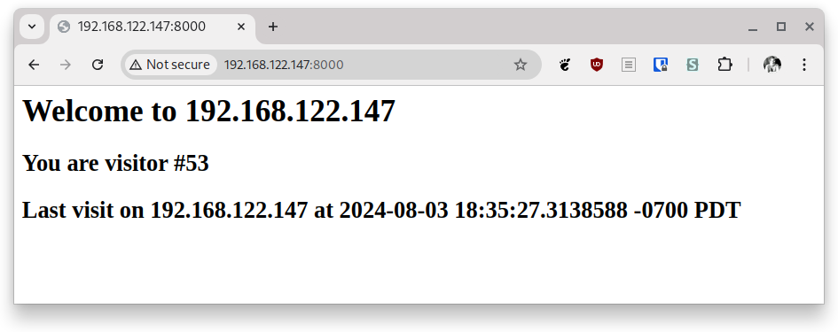

# visitor

Helper for demonstrating disaster recovery flows.

The visitor listens to port 8000, reporting the number of visitors and
the address of the host.

Example output:



## Using during failover or relocate

1. Wait until the next replication completes
1. Visit http://host-address-on-cluster1:service-port
1. Wait until the next replication completes
1. Start failover or relocate
1. Wait until the virtual machine is running on the other cluster
1. Visit http://host-address-on-cluster2:service-port

Check the visitor count and server address. The last visit will be
reported on original cluster address.

## The visitor.json file

The visitor stores the last visit info at `visitor.json` in the directory
where the server is started.

To clear the visitor state, delete the file.

## Configure Windows firewall

To allow remote access:

1. Open the *Firewall and network security* system setting
1. Click "Allow an app through firewall"
1. Click "Allow another app..."
1. Click "Browse..." and find `visitor.exe`
1. Click "Network types..." and enable both public and private networks
1. Click "Add"

## Using as Windows service

Create a service:

```
sc.exe create visitor start= auto binPath= "C:\Users\Administrator\Visitor\visitor.exe"
```

Start the service:

```
sc.exe start visitor
```

When running as a service, the `visitor.json` file is stored in the
directory where the executable is installed.

Stop the service:

```
sc.exe stop visitor
```

Delete the service:

```
sc.exe delete visitor
```

Tested with Windows server 2022.
